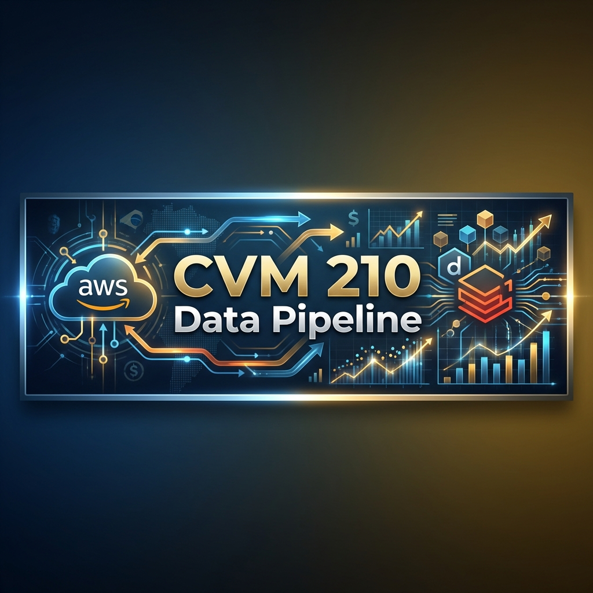
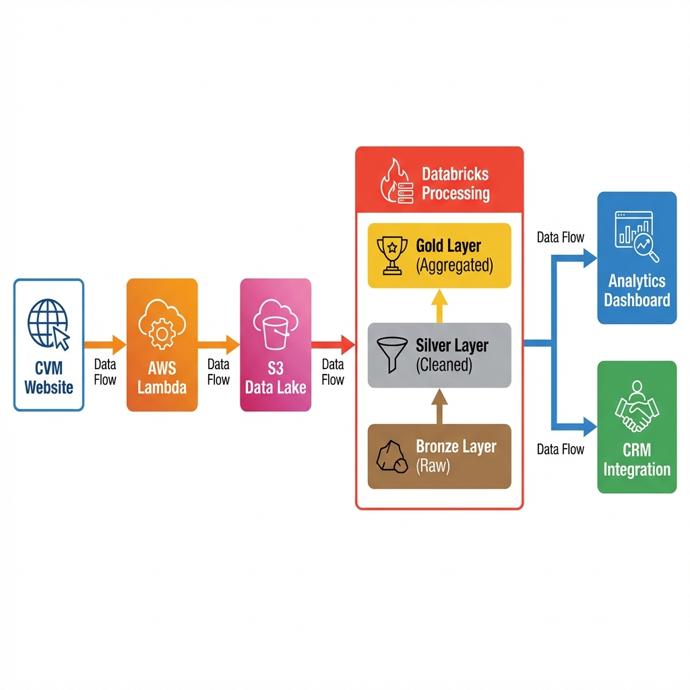
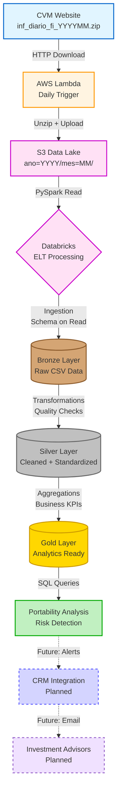
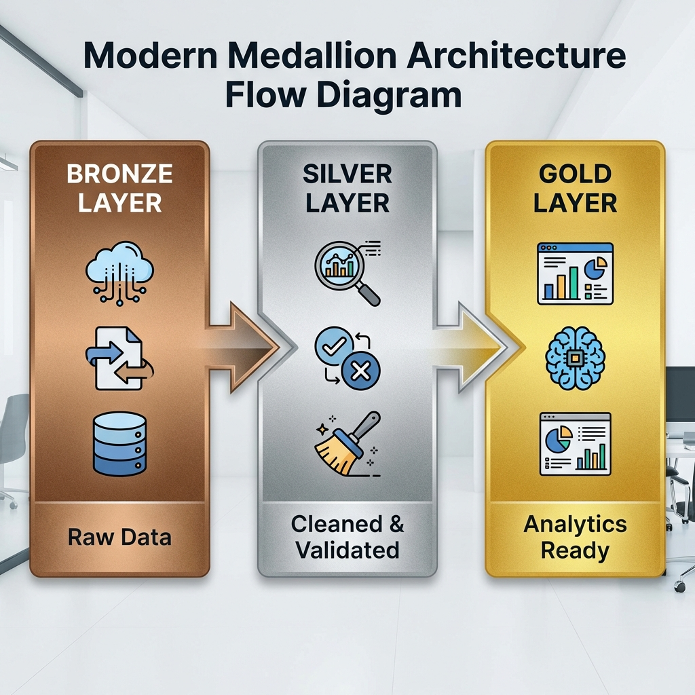

# 📊 CVM 210 Data Pipeline | End-to-End Cloud Data Platform for Financial Analytics




[](https://aws.amazon.com/)
[](https://databricks.com/)
[](https://www.python.org/)
[](https://spark.apache.org/)
[](LICENSE)
[](https://github.com/psf/black)

## 📑 Table of Contents

- [Overview](#-overview)
- [TL;DR](#-tldr)
- [Project Objectives](#-project-objectives)
- [Solution Architecture](#%EF%B8%8F-solution-architecture)
- [Technologies Used](#-technologies-used)
- [Project Structure](#-project-structure)
- [How to Run](#-how-to-run)
- [Analysis Examples](#-analysis-examples)
- [Business Rules & Governance](#-business-rules--governance)
- [Cost Optimization](#-cost-optimization-executive-summary)
- [Performance Metrics](#-performance-metrics)
- [Key Generated Insights](#-key-generated-insights)
- [Technical Decisions](#-technical-decisions)
- [Troubleshooting](#-troubleshooting)
- [Next Steps](#-next-steps)
- [Project Highlights](#-project-highlights)
- [About the Author](#-about-the-author)
- [License](#-license)

---

## 📌 Overview

This project implements a **complete data engineering solution** to capture, process, and analyze public information from the **CVM (Resolution CVM 210)**, simulating a real market scenario where no official API is available for direct consumption of regulatory data.

> [!IMPORTANT]
> **Regulatory Context**: Although the CVM provides public data on its portal, **information from CVM Resolution 210 (investment portability) is of restricted access** and is not publicly available. This project demonstrates the ability to build a robust architecture for capturing and analyzing such data in a real corporate environment.

The goal was to solve a real business problem, from **automated ingestion** to **strategic analysis**, using a modern cloud architecture (**AWS + Databricks**) and best practices for production-level Data Engineering.

---

## 🚀 TL;DR

- End-to-end **data engineering pipeline** for **CVM 210** regulatory data
- **Automated daily ingestion** using AWS Lambda
- **AWS-based Data Lake** on Amazon S3
- **ELT processing** on Databricks with **Medallion Architecture**
- **Delta Lake** enabling ACID transactions, schema evolution, and time travel
- **Decision-ready analytics** for fund portability, capital outflow risk, and regulatory insights

---

## 🎯 Project Objectives

✅ **Automate daily capture** of data published by CVM  
✅ **Ensure persistence, history, and traceability** of information  
✅ **Transform raw data into reliable analytical information**  
✅ **Enable portability analysis and fund movement detection**  
✅ **Create a scalable base** for future financial strategies  

---

## 🏗️ Solution Architecture



### Complete Data Flow



> **Legend**: Components with dashed borders and dotted arrows represent planned features (Future State).

### 🔹 Data Ingestion

- **Daily execution via AWS Lambda**, aligned with CVM publication schedule.
- **Direct extraction from CVM website** (simulating ingestion via authorized institution API).
- **Generation of daily files in Amazon S3** (Data Lake – Raw Zone).
- **Automatic decompression** of ZIP files to CSV.

### 🔹 Storage

- **Data organization in S3** with logical partitioning by date (`ano=YYYY/mes=MM/`).
- **Historical persistence** for auditing and reprocessing.
- **Base prepared for schema evolution**.

### 🔄 Processing & Transformation (ELT)

**Medallion Architecture implemented on Databricks:**



#### **Bronze Layer** 🟤
- Raw data ingested directly from S3.
- Schema on read.
- No transformations.
- Full history preserved.

#### **Silver Layer** ⚪
- **Cleaning and standardization** of data.
- **Column handling** (compatibility between CVM 175 vs legacy formats).
- **Data Quality validations** (valid values, mandatory fields).
- **Deduplication** via merge (guaranteeing no duplicates).
- **Automatic schema evolution**.
- **Z-Order optimization** by CNPJ_FUNDO.

#### **Gold Layer** 🟡
- **Aggregations by fund and period**.
- **Calculated Business KPIs:**
  - Total inflows
  - Total outflows
  - **Net flow** (inflow - outflow)
  - Average NAV (Net Asset Value)
  - Net Asset Value variation
  - **Portability indicators**
- **Data ready for BI and analytics**.

---

## 🔧 Technologies Used

| Layer | Technology | Purpose |
|--------|-----------|-----------|
| **Ingestion** | AWS Lambda + Python | Automated daily capture |
| **Storage** | Amazon S3 | Data Lake (Raw Zone) |
| **Processing** | Databricks + PySpark | Distributed processing |
| **Data Format** | Delta Lake | Versioning, ACID, Time Travel |
| **Orchestration** | AWS EventBridge (daily trigger) | Scheduling |
| **Governance** | Unity Catalog | Metadata catalog |

---

## 📂 Project Structure

```
eng-dados-project/
│
├── assets/
│   └── images/                   # Project images (banner, diagrams)
│       ├── project_banner.png
│       ├── architecture_diagram.png
│       └── medallion_flow.png
│
├── notebooks/                    # Jupyter Notebooks
│   ├── main_pipeline.ipynb       # Main pipeline (Bronze → Silver → Gold)
│   └── analytics.ipynb           # Portability analysis and insights
│
<<<<<<< HEAD
├── lambda/                       # AWS Lambda function
│   └── lambda_function.py        # Lambda function for daily ingestion
│
├── docs/                         # Technical documentation
│   ├── lambda_ingestion.md       # Lambda ingestion details
│   ├── data_pipeline.md          # ELT pipeline details
│   └── analytics_guide.md        # Guide for available analyses
│
├── requirements/                 # Python dependencies
│   └── requirements.txt          # Project dependencies
=======
├── lambda/                          # Reusable Python code
│   ├── lambda_function.py            # Lambda function for daily ingestion
│
├── docs/                         # Technical documentation
│   ├── lambda_ingestion.md      # Lambda ingestion details
│   ├── data_pipeline.md         # ELT pipeline details
│   └── analytics_guide.md       # Guide for available analyses
|
├── requirements/
|   ├── requirements.txt            # Python dependencies
>>>>>>> f7c61e0cd6d6ecec9ca7ce7d0de7ca7a76be0a85
│
├── .gitignore                    # Git ignored files
├── LICENSE                       # MIT License
└── README.md                     # This file
```

---

## 🚀 How to Run

### 1️⃣ Ingestion Setup (AWS Lambda)

```bash
# Deploy Lambda function
aws lambda create-function \
  --function-name cvm210-daily-ingestion \
  --runtime python3.9 \
  --role <IAM_ROLE_ARN> \
  --handler lambda_function.lambda_handler \
  --zip-file fileb://lambda_function.zip

# Configure daily trigger (EventBridge)
aws events put-rule \
  --name cvm210-daily-trigger \
  --schedule-expression "cron(0 20 * * ? *)"
```

### 2️⃣ Processing on Databricks

1. **Configure AWS credentials** on Databricks (via Secrets or IAM Role).
2. **Execute notebook `notebooks/main_pipeline.ipynb`** to create Bronze/Silver/Gold layers.
3. **Execute notebook `notebooks/analytics.ipynb`** for portability analysis.

### 3️⃣ Query Analytical Data

```sql
-- Example: Funds with highest capital outflow (portability)
SELECT 
  CNPJ_FUNDO,
  total_captacao,
  total_resgate,
  fluxo_liquido,
  patrimonio_medio
FROM cvm_p210.gold_cvm210_analytics
WHERE fluxo_liquido < 0
ORDER BY fluxo_liquido ASC
LIMIT 10;
```

---

## 📊 Analysis Examples

### Portability Analysis

The project generates **actionable insights** for the business team:

- **Funds at risk** (with negative net flow)
- **Total volume moved** by portability type
- **Inflow vs Outflow trends**

**Output Example:**

| CNPJ_FUNDO | Total Inflow | Total Outflow | Net Flow | Average NAV |
|------------|--------------|---------------|----------|-------------|
| 12.345.678 | R$ 1.2M | R$ 2.5M | **-R$ 1.3M** | R$ 450M |
| 23.456.789 | R$ 800K | R$ 1.1M | **-R$ 300K** | R$ 120M |

---

## 🧠 Business Rules & Governance

### Data Quality
- ✅ Validation of **mandatory fields** (CNPJ_FUNDO, DT_COMPTC)
- ✅ Filtering of **Net Asset Value > 0**
- ✅ **Automatic deduplication** via merge

### Metadata and Traceability
- ✅ Processing timestamp in each layer
- ✅ Partitioning by **year/month**
- ✅ Versioning via **Delta Lake**

### Security & Governance
- 🔒 **AWS Credentials**: IAM Roles via Instance Profile (production-ready)
- 🔒 **Storage**: Unity Catalog for access control
- 🔒 **Auditing**: Delta Lake transaction log for full traceability
- 🔒 **Versioning**: Time Travel enabled for rollbacks
- 🔒 **Data Lineage**: Automatic tracking of transformations

---

## 💰 Cost Optimization (Executive Summary)

💰 **Estimated annual savings**: For 10,000 queries/year, savings of **~$137** (from $172 to $35).

This gain was achieved mainly through:
- **Use of Columnar Formats (Parquet)**: Drastic reduction in the amount of data read.
- **Snappy Compression**: Perfect balance between compression ratio and read speed.
- **Medallion Architecture**: Reduction of unnecessary scans by querying refined layers.
- **Serverless / On-Demand Processing**: Efficient use of AWS Lambda and Databricks clusters with auto-termination.

---

## 📊 Performance Metrics

### Ingestion Pipeline (Lambda)
| Metric | Typical Value |
|---------|--------------|
| **Execution Time** | ~15-25 seconds |
| **Memory Used** | ~300-400 MB |
| **Data Downloaded** | ~800 MB - 1.2 GB |
| **Upload to S3** | ~5-8 seconds |

### Processing Pipeline (Databricks)
| Layer | Average Time | Processed Volume |
|--------|-------------|-------------------|
| **Bronze** | ~2 min | 1.5M+ rows |
| **Silver** | ~3-5 min | 1.5M rows (post-cleaning) |
| **Gold** | ~1-2 min | ~1K aggregations |
| **Total Pipeline** | **~10 min** | **~1.5M rows** |

---

## 🔍 Key Generated Insights

The pipeline demonstrates how the architecture supports complex analyses with low cost and high performance, enabling strategic decisions:

✅ **Portability Trends**: Detection of funds with a high trend of capital outflow for preventive retention.

✅ **Concentration Risk**: Identification of assets with high concentration in a few investors, mitigating systemic risks.

✅ **Market Resilience**: Analysis of how quotas and equity reacted to specific market events.

✅ **Regulatory Compliance**: Guarantee of data integrity and consistency as per CVM Resolution 210.

✅ **Economic Impact**: Correlation between market movements and variations in the net flow of specific funds.

---

## 🧠 Technical Decisions

### Why Medallion Architecture?
| Layer | Purpose | Benefit |
|-------|---------|---------|
| **Bronze** | Immutable raw data | Audit and reprocessing |
| **Silver** | Clean and structured data | Quality and consistency |
| **Gold** | Business metrics | Query performance |

### Why Databricks instead of EMR or Glue?
- ✅ **Managed Service**: Ease of collaboration and lower operational overhead.
- ✅ **Delta Lake Features**: Native ACID transactions, Time Travel, and Schema Evolution.
- ✅ **Cost-effective**: Auto-termination and Spot Instances significantly reduce costs.
- ✅ **Performance**: Photon engine optimizes distributed processing.

### Why Parquet + Snappy?
- **Parquet**: Columnar format (selective scan) that reads only the columns necessary for the query.
- **Snappy**: Decompression speed 2-3x faster than GZIP, ideal for real-time processing.
- **Cost-benefit**: Occupies ~60% of the size of a GZIP CSV but allows much faster and cheaper queries.

---

## 👨‍💻 About the Author

**Gabriel Henrique - Data Engineer**

🎓 Data Engineering Post-Graduate Student | **FIAP**

💼 Specialized in Modern Data Architectures on AWS (S3, Lambda, Databricks, PySpark)

🚀 Data Engineer focused on solving real-world data problems.

💡 *Open to opportunities in Data Engineering, Analytics Engineering, and Cloud Data Platforms.*

---

## 📝 License

This project is part of an academic work.

Public data provided by **CVM (Commission of Securities and Exchange of Brazil)**.

---

## 🙏 Acknowledgments

- **CVM** for providing public financial microdata.
- **AWS** for complete documentation and powerful Data Engineering tools.

⭐ *If this project was useful, consider giving it a star on the repository!*

**Developed with ❤️ using AWS Lambda, S3, Databricks, and PySpark.**
> [!NOTE]
> This project was developed in an AWS Academy laboratory environment for educational purposes. 
> The demonstrated resources were provisioned temporarily and subsequently removed.
