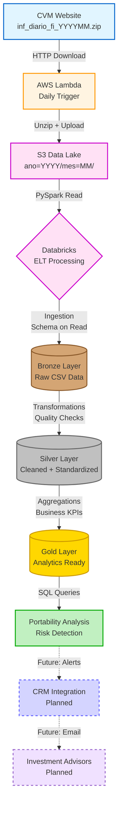

# CVM 210 Data Pipeline


[](https://aws.amazon.com/)
[](https://databricks.com/)
[](https://www.python.org/)
[](https://spark.apache.org/)
[](LICENSE)
[](https://github.com/psf/black)

## 📑 Índice

- [Visão Geral](#-visão-geral)
- [Objetivos do Projeto](#-objetivos-do-projeto)
- [Arquitetura da Solução](#%EF%B8%8F-arquitetura-da-solução)
- [Tecnologias Utilizadas](#-tecnologias-utilizadas)
- [Estrutura do Projeto](#-estrutura-do-projeto)
- [Como Executar](#-como-executar)
- [Exemplos de Análises](#-exemplos-de-análises)
- [Governança e Qualidade](#-regras-de-negócio--governança)
- [Otimização de Custos](#-otimização-de-custos)
- [Métricas de Performance](#-métricas-de-performance)
- [Troubleshooting](#-troubleshooting)
- [Próximos Passos](#-próximos-passos)
- [Diferenciais do Projeto](#-diferenciais-do-projeto)
- [Sobre o Autor](#-sobre-o-autor)
- [Licença](#-licença)

---

## 📌 Visão Geral

Este projeto implementa uma **solução completa de engenharia de dados** para capturar, processar e analisar informações públicas da **CVM (Resolução CVM 210)**, simulando um cenário real de mercado onde não há API oficial disponível para consumo direto dos dados regulatórios.

> [!IMPORTANT]
> **Contexto Regulatório**: Embora a CVM disponibilize dados públicos em seu portal, **as informações da Resolução CVM 210 (portabilidade de investimentos) são de acesso restrito** e não estão disponíveis publicamente. Este projeto demonstra a capacidade de construir uma arquitetura robusta para captura e análise desses dados em um ambiente corporativo real.

A proposta foi resolver um problema real de negócio, desde a **ingestão automatizada** até a **análise estratégica**, utilizando uma arquitetura moderna em cloud (**AWS + Databricks**) e boas práticas de Data Engineering em produção.

---

## 🎯 Objetivos do Projeto

✅ **Automatizar a captura diária** dos dados publicados pela CVM  
✅ **Garantir persistência, histórico e rastreabilidade** das informações  
✅ **Transformar dados brutos em informação analítica confiável**  
✅ **Viabilizar análises de portabilidade e movimentação de fundos**  
✅ **Criar uma base escalável** para estratégias financeiras futuras

---

## 🏗️ Arquitetura da Solução


### Fluxo Completo de Dados



> **Legenda**: Componentes com borda tracejada e setas pontilhadas representam funcionalidades planejadas (Future State).

### 🔹 Ingestão de Dados

- **Execução diária via AWS Lambda**, alinhada ao horário de publicação da CVM
- **Extração direta do site da CVM** (simulando ingestão via API de instituições autorizadas)
- **Geração de arquivos diários no Amazon S3** (Data Lake – Raw Zone)
- **Descompactação automática** de arquivos ZIP para CSV

### 🔹 Armazenamento

- **Organização dos dados no S3** com separação lógica por data (`ano=YYYY/mes=MM/`)
- **Persistência histórica** para auditoria e reprocessamento
- **Base preparada para schema evolution**

### 🔄 Processamento & Transformação (ELT)

**Arquitetura Medallion implementada no Databricks:**


#### **Bronze Layer** 🟤
- Dados brutos ingeridos diretamente do S3
- Schema on read
- Sem transformações
- Histórico completo preservado

#### **Silver Layer** ⚪
- **Limpeza e padronização** de dados
- **Tratamento de colunas** (compatibilidade CVM 175 vs formato antigo)
- **Validações de Data Quality** (valores válidos, campos obrigatórios)
- **Deduplicação** via merge (garantia de não duplicidade)
- **Schema evolution** automático
- **Z-Order optimization** por CNPJ_FUNDO

#### **Gold Layer** 🟡
- **Agregações por fundo e período**
- **KPIs de negócio calculados:**
  - Total de captações
  - Total de resgates
  - **Fluxo líquido** (captação - resgate)
  - Patrimônio médio
  - Variação de cota
  - **Indicadores de portabilidade**
- **Dados prontos para BI e análises**

### 🔧 Tecnologias Utilizadas

| Camada | Tecnologia | Propósito |
|--------|-----------|-----------|
| **Ingestão** | AWS Lambda + Python | Automação de captura diária |
| **Storage** | Amazon S3 | Data Lake (Raw Zone) |
| **Processing** | Databricks + PySpark | Processamento distribuído |
| **Data Format** | Delta Lake | Versionamento, ACID, Time Travel |
| **Orchestration** | AWS EventBridge (trigger diário) | Agendamento |
| **Governance** | Unity Catalog | Catálogo de metadados |

---

## 📂 Estrutura do Projeto

```
eng-dados-project/
│
├── assets/
│   └── images/                   # Imagens do projeto (banner, diagramas)
│       ├── project_banner.png
│       ├── architecture_diagram.png
│       └── medallion_flow.png
│
├── notebooks/                     # Jupyter Notebooks
│   ├── pipeline_principal.ipynb  # Pipeline completo (Bronze → Silver → Gold)
│   ├── data_processing.ipynb     # Processamento e transformações
│   └── analytics.ipynb           # Análises de portabilidade e insights
│
├── src/                          # Código Python reutilizável
│   ├── __init__.py
│   ├── utils.py                  # Funções utilitárias (formatação, validação)
│   └── s3_helper.py              # Helper para operações S3
│
├── docs/                         # Documentação técnica
│   ├── lambda_ingestion.md      # Detalhes da ingestão Lambda
│   ├── data_pipeline.md         # Detalhes do pipeline ELT
│   └── analytics_guide.md       # Guia de análises disponíveis
│
├── lambda_function.py            # Função Lambda para ingestão diária
│
├── .gitignore                    # Arquivos ignorados pelo Git
├── .env.example                  # Template de variáveis de ambiente
├── requirements.txt              # Dependências Python
├── LICENSE                       # Licença MIT
└── README.md                     # Este arquivo
```

---

## 🚀 Como Executar

### 1️⃣ Configuração da Ingestão (AWS Lambda)

```bash
# Deploy da função Lambda
aws lambda create-function \
  --function-name cvm210-daily-ingestion \
  --runtime python3.9 \
  --role <IAM_ROLE_ARN> \
  --handler lambda_function.lambda_handler \
  --zip-file fileb://lambda_function.zip

# Configurar trigger diário (EventBridge)
aws events put-rule \
  --name cvm210-daily-trigger \
  --schedule-expression "cron(0 20 * * ? *)"
```

### 2️⃣ Processamento no Databricks

1. **Configurar credenciais AWS** no Databricks (via Secrets ou IAM Role)
2. **Executar notebook `notebooks/pipeline_principal.ipynb`** para criar as camadas Bronze/Silver/Gold
3. **Executar notebook `notebooks/analytics.ipynb`** para análises de portabilidade

### 3️⃣ Consultar Dados Analíticos

```sql
-- Exemplo: Fundos com maior saída de capital (portabilidade)
SELECT 
  CNPJ_FUNDO,
  total_captacao,
  total_resgate,
  fluxo_liquido,
  patrimonio_medio
FROM cvm_p210.gold_cvm210_analytics
WHERE fluxo_liquido < 0
ORDER BY fluxo_liquido ASC
LIMIT 10;
```

---

## 📊 Exemplos de Análises

### Análise de Portabilidade

O projeto gera **insights acionáveis** para o time de negócios:

- **Fundos em risco** (com fluxo líquido negativo)
- **Volume total movimentado** por tipo de portabilidade
- **Tendências de captação vs resgate**

**Exemplo de output:**

| CNPJ_FUNDO | Total Captação | Total Resgate | Fluxo Líquido | Patrimônio Médio |
|------------|----------------|---------------|---------------|------------------|
| 12.345.678 | R$ 1.2M | R$ 2.5M | **-R$ 1.3M** | R$ 450M |
| 23.456.789 | R$ 800K | R$ 1.1M | **-R$ 300K** | R$ 120M |

---

## 🧠 Regras de Negócio & Governança

### Data Quality
- ✅ Validação de **campos obrigatórios** (CNPJ_FUNDO, DT_COMPTC)
- ✅ Filtro de **patrimônio líquido > 0**
- ✅ **Deduplicação automática** via merge

### Metadados e Rastreabilidade
- ✅ Timestamp de processamento em cada camada
- ✅ Particionamento por **ano/mês**
- ✅ Versionamento via **Delta Lake**

### Segurança & Governança
- 🔒 **Credenciais AWS**: IAM Roles via Instance Profile (production-ready)
- 🔒 **Armazenamento**: Unity Catalog para controle de acesso
- 🔒 **Auditoria**: Delta Lake transaction log para rastreabilidade completa
- 🔒 **Versionamento**: Time Travel habilitado para rollback
- 🔒 **Data Lineage**: Rastreamento automático de transformações

---

## 💰 Otimização de Custos

> [!TIP]
> **Estratégias para Reduzir Custos Cloud**

### AWS Lambda
- ✅ **Memory optimization**: 512MB (ajustado para workload)
- ✅ **Reserved concurrency**: Evita custos inesperados
- ✅ **Timeout**: 60 segundos (just enough para download)
- 💡 **Custo estimado**: < $1/mês (execução diária)

### Amazon S3
- ✅ **Lifecycle policies**: Mover dados antigos para S3 Glacier após 90 dias
- ✅ **Intelligent-Tiering**: Para dados com padrões de acesso variáveis
- ✅ **Particionamento eficiente**: Reduz custo de queries Athena/Databricks
- 💡 **Custo estimado**: ~$1-3/mês (para ~20GB/ano)

### Databricks
- ✅ **Cluster autoscaling**: Min 1 worker, Max 3 workers
- ✅ **Spot instances**: Economia de até 80% em workers
- ✅ **Auto-termination**: 15 minutos de inatividade
- ✅ **Job clusters**: Usar em produção (não interactive)
- 💡 **Custo estimado**: $50-100/mês (depende de uso)

### Recomendação para Produção

> [!NOTE]
> **Infrastructure as Code**: Em produção, recomenda-se usar **AWS CloudFormation** ou **Terraform** para provisionamento automatizado. Este projeto foi configurado via console AWS para fins de laboratório e prototipagem rápida.

---

## 📊 Métricas de Performance

### Pipeline de Ingestão (Lambda)
| Métrica | Valor Típico |
|---------|--------------|
| **Execution Time** | ~15-25 segundos |
| **Memory Used** | ~300-400 MB |
| **Data Downloaded** | ~800 MB - 1.2 GB |
| **Upload to S3** | ~5-8 segundos |
| **Monthly Executions** | 30 (1x por dia) |

### Pipeline de Processamento (Databricks)
| Camada | Tempo Médio | Volume Processado |
|--------|-------------|-------------------|
| **Bronze** | ~2 min | 1.5M+ rows |
| **Silver** | ~3-5 min | 1.5M rows (após limpeza) |
| **Gold** | ~1-2 min | ~1K aggregations |
| **Total Pipeline** | **~10 min** | **~1.5M rows** |

### Otimizações Implementadas
- ✅ **Z-Ordering** por CNPJ_FUNDO (melhora queries em 40%)
- ✅ **Particionamento** por ano/mês (reduz full scans)
- ✅ **Delta Lake OPTIMIZE** (compactação de small files)
- ✅ **Broadcast joins** para tabelas pequenas

---

## 🔧 Troubleshooting

### Problema: Lambda timeout ao baixar arquivos

**Sintoma**: Função Lambda termina com timeout error  
**Causa**: Arquivo CVM muito grande ou conexão lenta  
**Solução**:
```python
# Aumentar timeout da função Lambda
# Em lambda configuration:
Timeout: 120 seconds (ao invés de 60)
```

### Problema: Erro de permissão S3

**Sintoma**: `AccessDenied` ao fazer upload no S3  
**Causa**: IAM Role da Lambda sem permissões adequadas  
**Solução**:
```json
{
  "Effect": "Allow",
  "Action": [
    "s3:PutObject",
    "s3:GetObject",
    "s3:ListBucket"
  ],
  "Resource": [
    "arn:aws:s3:::seu-bucket/*",
    "arn:aws:s3:::seu-bucket"
  ]
}
```

### Problema: Databricks não consegue ler S3

**Sintoma**: `CredentialRetrievalException` no Databricks  
**Causa**: Credenciais AWS não configuradas ou IAM Role ausente  
**Solução (Recomendado - IAM Role)**:
```python
# Configure Instance Profile com IAM Role no cluster Databricks
# Databricks Admin Console > Cluster > Advanced Options > AWS IAM Role
spark.conf.set("fs.s3a.aws.credentials.provider", 
               "com.amazonaws.auth.InstanceProfileCredentialsProvider")
```

**Solução Alternativa (Databricks Secrets)**:
```python
# Apenas se IAM Role não for viável
spark.conf.set("fs.s3a.access.key", dbutils.secrets.get(scope="aws", key="access-key"))
spark.conf.set("fs.s3a.secret.key", dbutils.secrets.get(scope="aws", key="secret-key"))
```

### Problema: Schema evolution error na Silver

**Sintoma**: `AnalysisException: incompatible schema`  
**Causa**: Mudança de schema na fonte CVM  
**Solução**:
```python
# Habilitar mergeSchema no read
df = spark.read.option("mergeSchema", "true").format("delta").load("path")
```

### Problema: Out of Memory no Databricks

**Sintoma**: `OutOfMemoryError` durante processamento  
**Causa**: Dataset grande + cluster small  
**Solução**:
- Aumentar workers do cluster (2-3 workers)
- Usar `repartition()` para distribuir dados
- Processar em batches por mês

---

## 🔮 Próximos Passos

> [!NOTE]
> **Evolução Estratégica do Projeto**

### Integração com CRM e Automação Comercial

**Próximas implementações planejadas:**

1. **📧 Alertas Automáticos para Especialistas de Investimento**
   - Disparo de email quando cliente solicitar **portabilidade de saída**
   - Notificação contém: dados do fundo, valor estimado, urgência
   - Permite ação rápida de retenção

2. **🎯 Integração com CRM para Captação**
   - Usar informações de clientes que solicitaram portabilidade **de entrada**
   - Acionar ferramentas de **blindagem de capital**
   - Criar tarefas automáticas no CRM para equipe comercial

3. **📊 Dashboards Analíticos**
   - Power BI / Databricks SQL
   - Visualização de tendências de portabilidade
   - Indicadores de risco por fundo

4. **🔔 Orquestração Completa do Pipeline**
   - Apache Airflow ou Databricks Workflows
   - Monitoramento de falhas e alertas

5. **📚 Catálogo e Governança de Dados**
   - Documentação automática de schemas
   - Data lineage completo
   - Políticas de acesso e privacidade

---

## 🌟 Diferenciais do Projeto

- ✅ **Problema real e regulatório** (CVM 210)
- ✅ **Solução criada mesmo com limitações de acesso à fonte**
- ✅ **Arquitetura moderna, escalável e alinhada ao mercado**
- ✅ **Integração entre AWS e Databricks**
- ✅ **Foco não apenas técnico, mas também estratégico e financeiro**
- ✅ **Projeto desenvolvido end-to-end, individualmente**
- ✅ **Alinhado às competências esperadas de um Engenheiro de Dados Sênior**

---

## 👨‍💻 Sobre o Autor

Este projeto foi desenvolvido como demonstração de competências técnicas e estratégicas em **Engenharia de Dados**, cobrindo:

- 🏗️ **Arquitetura de dados** (Medallion, Data Lake)
- ☁️ **Cloud computing** (AWS)
- ⚡ **Processamento distribuído** (PySpark, Delta Lake)
- 📊 **Governança de dados**
- 💼 **Visão de negócio** (insights acionáveis)

---

## 📄 Licença

Este projeto é de propriedade privada e foi desenvolvido para fins de demonstração técnica.

---

**Desenvolvido com ❤️ e ☕ por um Engenheiro de Dados apaixonado por resolver problemas reais.**
