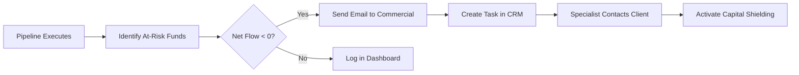

# Analytics Guide - CVM 210

## Overview

This guide documents the analyses available in the project, focusing on **investment portability** and **actionable business insights**.

---

## Available Analyses

### 📊 1. Volumetric Portability Analysis

#### Objective
Identify the **total volume moved** and the **relationship between inflows and outflows** per fund.

#### Base Query

```python
from pyspark.sql.functions import count, sum, abs, round

volumetric_analysis = (
    spark.table("cvm_p210.gold_cvm210_analytics")
    .select(
        "CNPJ_FUNDO",
        "dias_negociacao",
        "total_captacao",
        "total_resgate",
        "fluxo_liquido",
        "valor_total_movimentado"
    )
    .orderBy("valor_total_movimentado", ascending=False)
)

display(volumetric_analysis)
```

#### Interpretation of Results

| Column | Meaning |
|--------|-------------|
| `dias_negociacao` | Number of business days in the period |
| `total_captacao` | Sum of all inflows for the month |
| `total_resgate` | Sum of all redemptions for the month |
| `fluxo_liquido` | Inflow - Redemption (Net Flow) |
| `valor_total_movimentado` | Total volume of transactions |

**Insights:**
- **Positive Net Flow**: Fund is capturing more than it is losing.
- **Negative Net Flow**: Fund is experiencing capital outflow ⚠️.

---

### 🚨 2. Identification of At-Risk Funds

#### Objective
Detect funds with **significant capital outflow** to trigger retention protocols.

#### Query

```python
at_risk_funds = (
    spark.table("cvm_p210.gold_cvm210_analytics")
    .filter("fluxo_liquido < 0")  # Outflow funds only
    .select(
        "CNPJ_FUNDO",
        "total_captacao",
        "total_resgate",
        "fluxo_liquido",
        "patrimonio_medio"
    )
    .orderBy("fluxo_liquido")  # Sort from worst to best
)

display(at_risk_funds)
```

#### Output Example

| CNPJ_FUNDO | Total Inflows | Total Redemptions | Net Flow | Average Equity |
|------------|----------------|---------------|---------------|------------------|
| 12.345.678 | $ 1,200,000 | $ 2,500,000 | **-$ 1,300,000** | $ 450,000,000 |
| 23.456.789 | $ 800,000 | $ 1,100,000 | **-$ 300,000** | $ 120,000,000 |

**Recommended Actions:**
1. ⚠️ **Alert investment specialist** for the fund.
2. 📞 **Contact shareholders** via CRM.
3. 🛡️ **Activate capital shielding protocol**.

---

### 📧 3. Report Generation for Commercial Team

#### Objective
Create **actionable emails** for the commercial team highlighting priority funds for retention.

#### Implementation

```python
def generate_commercial_email_body(fund_list):
    return f"""
    ⚠️ PORTABILITY ALERT - IMMEDIATE ACTION REQUIRED
    
    Funds detected with CAPITAL OUTFLOW in the last period.
    
    AT-RISK FUNDS DATA:
    {fund_list}
    
    RECOMMENDED ACTION:
    - Prioritize contact with shareholders of these funds via CRM.
    - Evaluate if the outflow is linked to recent performance or competition.
    - Activate retention protocol (Capital Shielding).
    
    This is an automated report from the CVM 210 Pipeline.
    """

# Generate list of top 10 funds with highest losses
top_risks = (
    spark.table("cvm_p210.gold_cvm210_analytics")
    .filter("fluxo_liquido < 0")
    .orderBy("fluxo_liquido")
    .limit(10)
    .toPandas()
)

list_str = ""
for index, row in top_risks.iterrows():
    list_str += f"- Fund: {row['CNPJ_FUNDO']} | Estimated Loss: $ {abs(row['fluxo_liquido']):,.2f}\n"

print(generate_commercial_email_body(list_str))
```

#### Generated Email Example

```
⚠️ PORTABILITY ALERT - IMMEDIATE ACTION REQUIRED

Funds detected with CAPITAL OUTFLOW in the last period.

AT-RISK FUNDS DATA:
- Fund: 12.345.678 | Estimated Loss: $ 1,300,000.00
- Fund: 23.456.789 | Estimated Loss: $ 300,000.00

RECOMMENDED ACTION:
- Prioritize contact with shareholders of these funds via CRM.
- Activate retention protocol (Capital Shielding).

This is an automated report from the CVM 210 Pipeline.
```

---

### 📈 4. Monthly Trend Analysis

#### Objective
Compare **inflows vs redemptions** over time.

#### Query

```sql
SELECT 
  ano,
  mes,
  SUM(total_captacao) AS monthly_inflow,
  SUM(total_resgate) AS monthly_redemption,
  SUM(fluxo_liquido) AS monthly_net_balance
FROM cvm_p210.gold_cvm210_analytics
GROUP BY ano, mes
ORDER BY ano DESC, mes DESC
```

#### Suggested Visualization

```python
import pandas as pd
import matplotlib.pyplot as plt

trend_df = spark.sql("""
    SELECT ano, mes, SUM(total_captacao) AS inflow, 
           SUM(total_resgate) AS redemption
    FROM cvm_p210.gold_cvm210_analytics
    GROUP BY ano, mes
    ORDER BY ano, mes
""").toPandas()

trend_df.plot(x='mes', y=['inflow', 'redemption'], kind='bar', figsize=(12,6))
plt.title('Inflow vs Redemption - Monthly Trend')
plt.ylabel('Value ($)')
plt.xlabel('Month')
plt.show()
```

---

### 🎯 5. Top Funds by Quota Performance

#### Objective
Identify funds with the **highest quota variation** in the period.

#### Query

```python
top_performance = (
    spark.table("cvm_p210.gold_cvm210_analytics")
    .select("CNPJ_FUNDO", "variacao_cota_mes", "patrimonio_medio")
    .orderBy("variacao_cota_mes", ascending=False)
    .limit(20)
)

display(top_performance)
```

**Use Case:** Evaluate if funds with good performance are capturing more investment.

---

## Future Integrations

> [!IMPORTANT]
> **Strategic Next Steps**

### 🔗 CRM Integration

**Objective:** Automate commercial actions based on portability.

#### Use Case 1: Client Requested Capital Outflow

```python
# Integration example (pseudo-code)
def notify_specialist(fund_cnpj, portability_value):
    client = search_client_by_fund(fund_cnpj)
    specialist = client['investment_specialist']
    
    send_email(
        recipient=specialist['email'],
        subject=f"⚠️ Client {client['name']} requested portability",
        body=f"""
        Your client {client['name']} requested CAPITAL OUTFLOW portability.
        
        Estimated value: $ {portability_value:,.2f}
        Fund: {fund_cnpj}
        
        URGENT ACTION: Contact client to understand the reason.
        """
    )
```

**Trigger:** Execute when `fluxo_liquido < -X` for a specific fund.

---

#### Use Case 2: Client Requested Capital Inflow

```python
def create_crm_capture_task(fund_cnpj, inflow_value):
    create_task(
        task_type="Portability Capture",
        description=f"Client requested CAPITAL INFLOW portability of $ {inflow_value:,.2f}",
        priority="High",
        fund=fund_cnpj,
        action="Contact to present products and shield capital"
    )
```

**Trigger:** Execute when `fluxo_liquido > X` for a specific fund.

---

### 📊 Recommended Dashboards

#### Power BI / Databricks SQL

**Suggested Visualizations:**

1. **Heatmap**: Net flow by fund and month.
2. **Bar Chart**: Top 10 funds with highest capture.
3. **Pie Chart**: Portability distribution (inflow vs outflow).
4. **Timeline**: Portability history throughout the year.
5. **KPI Cards**: Total captured, total redemptions, net balance.

---

## Full Workflow Example



---

## Frequently Asked Questions (FAQ)

### 1. How to identify if a specific client requested portability?

**A:** Currently, CVM 210 data is aggregated by **Fund CNPJ**, without individual shareholder identification. For specific cases, it would be necessary to cross-reference with the internal client database.

### 2. What is the ideal execution frequency for these analyses?

**A:** **Daily** execution is recommended after data ingestion for rapid detection of outflows.

### 3. Is it possible to predict future portability?

**A:** Yes! With 6-12 months of history, it is possible to create **predictive models** (ML) to anticipate outflows.

---

## Complete Code

[View Analytics CVM 210.ipynb](file:///c:/Users/Usuario/.gemini/antigravity/scratch/eng-dados-project/Analises%20CVM%20210.ipynb)
