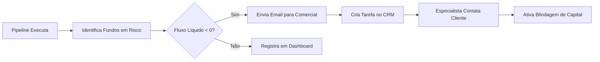

# Guia de Análises - CVM 210

## Visão Geral

Este guia documenta as análises disponíveis no projeto, com foco em **portabilidade de investimentos** e **insights acionáveis para o negócio**.

---

## Análises Disponíveis

### 📊 1. Análise Volumétrica de Portabilidade

#### Objetivo
Identificar o **volume total movimentado** e a **relação entre captações e resgates** por fundo.

#### Query Base

```python
from pyspark.sql.functions import count, sum, abs, round

analise_volumetrica = (
    spark.table("cvm_p210.gold_cvm210_analytics")
    .select(
        "CNPJ_FUNDO",
        "dias_negociacao",
        "total_captacao",
        "total_resgate",
        "fluxo_liquido",
        "valor_total_movimentado"
    )
    .orderBy("valor_total_movimentado", ascending=False)
)

display(analise_volumetrica)
```

#### Interpretação dos Resultados

| Coluna | Significado |
|--------|-------------|
| `dias_negociacao` | Número de dias úteis no período |
| `total_captacao` | Soma de todas as captações do mês |
| `total_resgate` | Soma de todos os resgates do mês |
| `fluxo_liquido` | Captação - Resgate |
| `valor_total_movimentado` | Volume total de transações |

**Insights:**
- **Fluxo líquido positivo**: Fundo está captando mais do que perdendo
- **Fluxo líquido negativo**: Fundo está com saída de capital ⚠️

---

### 🚨 2. Identificação de Fundos em Risco

#### Objetivo
Detectar fundos com **portabilidade de saída significativa** para acionar protocolo de retenção.

#### Query

```python
fundos_em_risco = (
    spark.table("cvm_p210.gold_cvm210_analytics")
    .filter("fluxo_liquido < 0")  # Apenas fundos com saída
    .select(
        "CNPJ_FUNDO",
        "total_captacao",
        "total_resgate",
        "fluxo_liquido",
        "patrimonio_medio"
    )
    .orderBy("fluxo_liquido")  # Ordena do pior para o melhor
)

display(fundos_em_risco)
```

#### Exemplo de Output

| CNPJ_FUNDO | Total Captação | Total Resgate | Fluxo Líquido | Patrimônio Médio |
|------------|----------------|---------------|---------------|------------------|
| 12.345.678 | R$ 1.200.000 | R$ 2.500.000 | **-R$ 1.300.000** | R$ 450.000.000 |
| 23.456.789 | R$ 800.000 | R$ 1.100.000 | **-R$ 300.000** | R$ 120.000.000 |

**Ações Recomendadas:**
1. ⚠️ **Alertar especialista de investimento** do fundo
2. 📞 **Contatar cotistas** via CRM
3. 🛡️ **Ativar protocolo de blindagem de capital**

---

### 📧 3. Geração de Relatório para Equipe Comercial

#### Objetivo
Criar **email acionável** para a equipe comercial com fundos prioritários para retenção.

#### Implementação

```python
def gerar_corpo_email_comercial(lista_fundos):
    return f"""
    ⚠️ ALERTA DE PORTABILIDADE - AÇÃO IMEDIATA NECESSÁRIA
    
    Fundos detectados com SAÍDA DE CAPITAL no último período.
    
    DADOS DOS FUNDOS EM RISCO:
    {lista_fundos}
    
    AÇÃO RECOMENDADA:
    - Priorizar contato com os cotistas destes fundos via CRM.
    - Avaliar se a saída está atrelada à performance recente ou concorrência.
    - Ativar protocolo de retenção (Blindagem de Capital).
    
    Este é um relatório automatizado do Pipeline CVM 210.
    """

# Gerar lista dos 10 fundos com maior perda
top_riscos = (
    spark.table("cvm_p210.gold_cvm210_analytics")
    .filter("fluxo_liquido < 0")
    .orderBy("fluxo_liquido")
    .limit(10)
    .toPandas()
)

lista_str = ""
for index, row in top_riscos.iterrows():
    lista_str += f"- Fundo: {row['CNPJ_FUNDO']} | Perda Estimada: R$ {abs(row['fluxo_liquido']):,.2f}\n"

print(gerar_corpo_email_comercial(lista_str))
```

#### Exemplo de Email Gerado

```
⚠️ ALERTA DE PORTABILIDADE - AÇÃO IMEDIATA NECESSÁRIA

Fundos detectados com SAÍDA DE CAPITAL no último período.

DADOS DOS FUNDOS EM RISCO:
- Fundo: 12.345.678 | Perda Estimada: R$ 1.300.000,00
- Fundo: 23.456.789 | Perda Estimada: R$ 300.000,00

AÇÃO RECOMENDADA:
- Priorizar contato com os cotistas destes fundos via CRM.
- Ativar protocolo de retenção (Blindagem de Capital).

Este é um relatório automatizado do Pipeline CVM 210.
```

---

### 📈 4. Análise de Tendências Mensais

#### Objetivo
Comparar **captação vs resgate** ao longo do tempo.

#### Query

```sql
SELECT 
  ano,
  mes,
  SUM(total_captacao) AS captacao_mensal,
  SUM(total_resgate) AS resgate_mensal,
  SUM(fluxo_liquido) AS saldo_liquido_mensal
FROM cvm_p210.gold_cvm210_analytics
GROUP BY ano, mes
ORDER BY ano DESC, mes DESC
```

#### Visualização Sugerida

```python
import pandas as pd
import matplotlib.pyplot as plt

df_tendencias = spark.sql("""
    SELECT ano, mes, SUM(total_captacao) AS captacao, 
           SUM(total_resgate) AS resgate
    FROM cvm_p210.gold_cvm210_analytics
    GROUP BY ano, mes
    ORDER BY ano, mes
""").toPandas()

df_tendencias.plot(x='mes', y=['captacao', 'resgate'], kind='bar', figsize=(12,6))
plt.title('Captação vs Resgate - Tendência Mensal')
plt.ylabel('Valor (R$)')
plt.xlabel('Mês')
plt.show()
```

---

### 🎯 5. Top Fundos por Performance de Cota

#### Objetivo
Identificar fundos com **maior variação de cota** no período.

#### Query

```python
top_performance = (
    spark.table("cvm_p210.gold_cvm210_analytics")
    .select("CNPJ_FUNDO", "variacao_cota_mes", "patrimonio_medio")
    .orderBy("variacao_cota_mes", ascending=False)
    .limit(20)
)

display(top_performance)
```

**Uso:** Avaliar se fundos com boa performance estão captando mais.

---

## Integrações Futuras

> [!IMPORTANT]
> **Próximos Passos Estratégicos**

### 🔗 Integração com CRM

**Objetivo:** Automatizar ações comerciais baseadas em portabilidade.

#### Caso de Uso 1: Cliente Solicitou Portabilidade de Saída

```python
# Exemplo de integração (pseudo-código)
def notificar_especialista(cnpj_fundo, valor_portabilidade):
    cliente = buscar_cliente_por_fundo(cnpj_fundo)
    especialista = cliente['especialista_investimento']
    
    enviar_email(
        destinatario=especialista['email'],
        assunto=f"⚠️ Cliente {cliente['nome']} solicitou portabilidade",
        corpo=f"""
        Seu cliente {cliente['nome']} solicitou portabilidade de SAÍDA.
        
        Valor estimado: R$ {valor_portabilidade:,.2f}
        Fundo: {cnpj_fundo}
        
        AÇÃO URGENTE: Entre em contato para entender o motivo.
        """
    )
```

**Trigger:** Executar quando `fluxo_liquido < -X` para um fundo específico.

---

#### Caso de Uso 2: Cliente Solicitou Portabilidade de Entrada

```python
def criar_tarefa_crm_captacao(cnpj_fundo, valor_entrada):
    criar_tarefa(
        tipo="Captação via Portabilidade",
        descricao=f"Cliente solicitou portabilidade de ENTRADA no valor de R$ {valor_entrada:,.2f}",
        prioridade="Alta",
        fundo=cnpj_fundo,
        acao="Contatar para apresentar produtos e blindar capital"
    )
```

**Trigger:** Executar quando `fluxo_liquido > X` para um fundo específico.

---

### 📊 Dashboards Recomendados

#### Power BI / Databricks SQL

**Visualizações sugeridas:**

1. **Mapa de Calor**: Fluxo líquido por fundo e mês
2. **Gráfico de Barras**: Top 10 fundos com maior captação
3. **Gráfico de Pizza**: Distribuição de portabilidade (entrada vs saída)
4. **Timeline**: Histórico de portabilidade ao longo do ano
5. **KPI Cards**: Total captado, total resgatado, saldo líquido

---

## Exemplo de Workflow Completo



---

## Perguntas Frequentes (FAQ)

### 1. Como identificar se um cliente específico pediu portabilidade?

**R:** Atualmente, os dados da CVM 210 são agregados por **CNPJ do fundo**, sem identificação individual do cotista. Para casos específicos, seria necessário cruzar com a base interna de clientes.

### 2. Qual a frequência ideal de execução dessas análises?

**R:** Recomenda-se execução **diária** após a ingestão dos dados, para detecção rápida de saídas.

### 3. É possível prever portabilidades futuras?

**R:** Sim! Com histórico de 6-12 meses, é possível criar **modelos preditivos** (ML) para antecipar saídas.

---

## Código Completo

[Ver Analises CVM 210.ipynb](file:///c:/Users/Usuario/.gemini/antigravity/scratch/eng-dados-project/Analises%20CVM%20210.ipynb)
