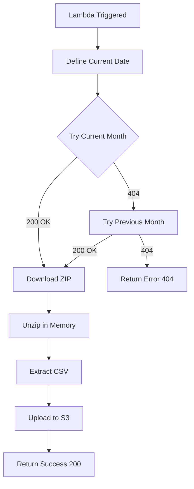

# Ingestion Documentation - AWS Lambda

## Overview

The `lambda_function.py` Lambda function is responsible for the **automated daily ingestion** of CVM Resolution 210 data, handling download, decompression, and persistence in S3.

## Ingestion Process

### 1. Daily Trigger

The function runs daily via **AWS EventBridge** (CloudWatch Events):

```
Trigger: cron(0 20 * * ? *)
Frequency: Daily, at 20:00 UTC
Alignment: CVM data publication schedule
```

### 2. Execution Flow



### 3. Latest File Search Logic

The code implements a **fallback strategy** to ensure it always captures the latest available file:

```python
now = datetime.now()
dates_to_try = [now, now.replace(day=1) - timedelta(days=1)]
```

**Scenarios:**
- **Day 1-31 of the month**: Tries the current month first.
- **If current month is not available**: Searches for the previous month.
- **Guarantee**: Always picks the most recently published file.

### 4. Download URL

```python
url_cvm = f"https://dados.cvm.gov.br/dados/FI/DOC/INF_DIARIO/DADOS/inf_diario_fi_{year}{month}.zip"
```

**Example:**
- January/2026: `inf_diario_fi_202601.zip`
- December/2025: `inf_diario_fi_202512.zip`

### 5. Decompression Process

The function **does not save the ZIP file in S3**, only the **extracted CSV**:

```python
# Read ZIP directly into memory
zip_buffer = io.BytesIO(response.read())

with zipfile.ZipFile(zip_buffer) as z:
    # Find the CSV inside the ZIP
    csv_name = [f for f in z.namelist() if f.endswith('.csv')][0]
    
    # Extract and upload directly
    with z.open(csv_name) as f:
        content = f.read()
        s3_client.put_object(Bucket=S3_BUCKET, Key=s3_key, Body=content)
```

**Advantages:**
- ✅ Saves space in S3 (no unnecessary ZIP storage).
- ✅ Processes in memory (fast).
- ✅ Data ready for Databricks consumption.

### 6. S3 Storage Structure

Data is organized with **date-based partitioning**:

```
s3://your-bucket-name/
└── cvm-transactions-daily/
    ├── ano=2026/
    │   ├── mes=01/
    │   │   └── inf_diario_fi_202601.csv
    │   └── mes=02/
    │       └── inf_diario_fi_202602.csv
    └── ano=2025/
        └── mes=12/
            └── inf_diario_fi_202512.csv
```

**Partitioning Benefits:**
- 🚀 **Performance**: Faster reads when filtering by period.
- 📦 **Organization**: Easy location of historical data.
- 🔄 **Reprocessing**: Ability to reprocess specific periods.

## Error Handling

### Implemented Strategy

```python
try:
    response = http.request('GET', url_cvm, preload_content=False)
    
    if response.status == 200:
        # Process file
        return {'statusCode': 200, 'body': f"Success! CSV at: {s3_key}"}
        
except Exception as e:
    print(f"Error: {str(e)}")
    continue

return {'statusCode': 404, 'body': "File not found."}
```

### Possible Errors

| Scenario | Status Code | Action |
|---------|-------------|------|
| File found | 200 | Processes and saves to S3 |
| File does not exist | 404 | Tries previous month |
| Network error | Exception | Log error and continue |
| Corrupted ZIP | Exception | Log error |

## Setup and Deployment

### Environment Variables

```python
S3_BUCKET = os.environ.get('S3_BUCKET')  # Configure in Lambda
S3_PREFIX = "cvm-transactions-daily"
```

### Dependencies (requirements.txt)

```
boto3==1.26.137
urllib3==1.26.15
```

### Required IAM Permissions

```json
{
  "Version": "2012-10-17",
  "Statement": [
    {
      "Effect": "Allow",
      "Action": [
        "s3:PutObject",
        "s3:GetObject"
      ],
      "Resource": "arn:aws:s3:::your-bucket-name/*"
    },
    {
      "Effect": "Allow",
      "Action": "logs:CreateLogGroup",
      "Resource": "*"
    }
  ]
}
```

## Monitoring

### CloudWatch Logs

Logs are automatically created in:
```
/aws/lambda/cvm210-daily-ingestion
```

**Example of success log:**
```
Attempting: inf_diario_fi_202601.zip
Success! CSV decompressed to: cvm-transactions-daily/ano=2026/mes=01/inf_diario_fi_202601.csv
```

**Example of error log:**
```
Attempting: inf_diario_fi_202601.zip
Error: HTTPError 404
Attempting: inf_diario_fi_202512.zip
Success! CSV decompressed to: cvm-transactions-daily/ano=2025/mes=12/inf_diario_fi_202512.csv
```

## Future Improvements

> [!TIP]
> **Next Implementations**

- [ ] **SNS Alerts** in case of ingestion failure.
- [ ] **CSV File Validation** before upload (verify expected columns).
- [ ] **Custom Metrics** (file size, processing time).
- [ ] **Automatic Retry** with exponential backoff.
- [ ] **Dead Letter Queue (DLQ)** for critical errors.

---

## Full Code

[View lambda_function.py](file:///c:/Users/Usuario/.gemini/antigravity/scratch/eng-dados-project/lambda/lambda_function.py)
