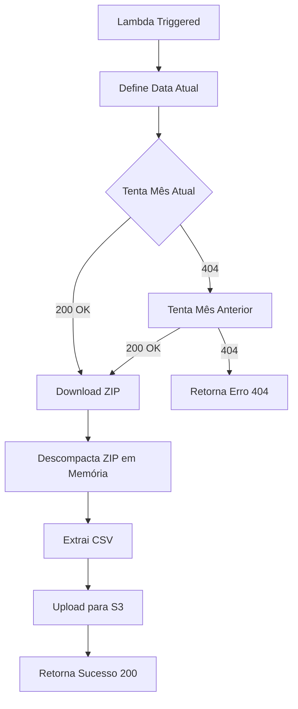

# Documentação da Ingestão - AWS Lambda

## Visão Geral

A função Lambda `lambda_function.py` é responsável pela **ingestão automatizada diária** dos dados da CVM Resolução 210, fazendo o download, descompactação e persistência no S3.

## Processo de Ingestão

### 1. Trigger Diário

A função é executada diariamente via **AWS EventBridge** (CloudWatch Events):

```
Trigger: cron(0 20 * * ? *)
Frequência: Diária, às 20:00 UTC
Alinhamento: Horário de publicação dos dados pela CVM
```

### 2. Fluxo de Execução



### 3. Lógica de Busca do Arquivo Mais Recente

O código implementa uma **estratégia de fallback** para garantir que sempre capture o arquivo mais recente disponível:

```python
agora = datetime.now()
datas_para_tentar = [agora, agora.replace(day=1) - timedelta(days=1)]
```

**Cenários:**
- **Dia 1-31 do mês**: Tenta o mês atual primeiro
- **Se mês atual não disponível**: Busca o mês anterior
- **Garante**: Sempre pega o arquivo mais recente publicado

### 4. URL de Download

```python
url_cvm = f"https://dados.cvm.gov.br/dados/FI/DOC/INF_DIARIO/DADOS/inf_diario_fi_{ano}{mes}.zip"
```

**Exemplo:**
- Janeiro/2026: `inf_diario_fi_202601.zip`
- Dezembro/2025: `inf_diario_fi_202512.zip`

### 5. Processo de Descompactação

A função **não salva o arquivo ZIP no S3**, apenas o **CSV descompactado**:

```python
# Lê o ZIP direto na memória
zip_buffer = io.BytesIO(response.read())

with zipfile.ZipFile(zip_buffer) as z:
    # Localiza o CSV dentro do ZIP
    csv_name = [f for f in z.namelist() if f.endswith('.csv')][0]
    
    # Extrai e faz upload direto
    with z.open(csv_name) as f:
        content = f.read()
        s3_client.put_object(Bucket=S3_BUCKET, Key=s3_key, Body=content)
```

**Vantagens:**
- ✅ Economiza espaço no S3 (não armazena ZIP desnecessário)
- ✅ Processa em memória (rápido)
- ✅ Dados já prontos para leitura do Databricks

### 6. Estrutura de Armazenamento no S3

Os dados são organizados com **particionamento por data**:

```
s3://your-bucket-name/
└── cvm-transactions-daily/
    ├── ano=2026/
    │   ├── mes=01/
    │   │   └── inf_diario_fi_202601.csv
    │   └── mes=02/
    │       └── inf_diario_fi_202602.csv
    └── ano=2025/
        └── mes=12/
            └── inf_diario_fi_202512.csv
```

**Benefícios do Particionamento:**
- 🚀 **Performance**: Leitura mais rápida ao filtrar por período
- 📦 **Organização**: Fácil localização de dados históricos
- 🔄 **Reprocessamento**: Possibilidade de reprocessar períodos específicos

## Tratamento de Erros

### Estratégia Implementada

```python
try:
    response = http.request('GET', url_cvm, preload_content=False)
    
    if response.status == 200:
        # Processa arquivo
        return {'statusCode': 200, 'body': f"Sucesso! CSV em: {s3_key}"}
        
except Exception as e:
    print(f"Erro: {str(e)}")
    continue

return {'statusCode': 404, 'body': "Arquivo não encontrado."}
```

### Possíveis Erros

| Cenário | Status Code | Ação |
|---------|-------------|------|
| Arquivo encontrado | 200 | Processa e salva no S3 |
| Arquivo não existe | 404 | Tenta mês anterior |
| Erro de rede | Exception | Log de erro e continua |
| ZIP corrompido | Exception | Log de erro |

## Configuração e Deployment

### Variáveis de Ambiente

```python
S3_BUCKET = os.environ.get('S3_BUCKET')  # Configure na Lambda
PASTA_BASE = "cvm-transactions-daily"
```

### Dependências (requirements.txt)

```
boto3==1.26.137
urllib3==1.26.15
```

### Permissões IAM Necessárias

```json
{
  "Version": "2012-10-17",
  "Statement": [
    {
      "Effect": "Allow",
      "Action": [
        "s3:PutObject",
        "s3:GetObject"
      ],
      "Resource": "arn:aws:s3:::your-bucket-name/*"
    },
    {
      "Effect": "Allow",
      "Action": "logs:CreateLogGroup",
      "Resource": "*"
    }
  ]
}
```

## Monitoramento

### CloudWatch Logs

Logs automaticamente criados em:
```
/aws/lambda/cvm210-daily-ingestion
```

**Exemplo de log de sucesso:**
```
Tentando: inf_diario_fi_202601.zip
Sucesso! CSV descompactado em: cvm-transactions-daily/ano=2026/mes=01/inf_diario_fi_202601.csv
```

**Exemplo de log de erro:**
```
Tentando: inf_diario_fi_202601.zip
Erro: HTTPError 404
Tentando: inf_diario_fi_202512.zip
Sucesso! CSV descompactado em: cvm-transactions-daily/ano=2025/mes=12/inf_diario_fi_202512.csv
```

## Melhorias Futuras

> [!TIP]
> **Próximas Implementações**

- [ ] **Alertas SNS** em caso de falha de ingestão
- [ ] **Validação do arquivo CSV** antes do upload (verificar colunas esperadas)
- [ ] **Métricas customizadas** (tamanho do arquivo, tempo de processamento)
- [ ] **Retry automático** com exponential backoff
- [ ] **Dead Letter Queue (DLQ)** para erros críticos

---

## Código Completo

[Ver lambda_function.py](file:///c:/Users/Usuario/.gemini/antigravity/scratch/eng-dados-project/lambda_function.py)
